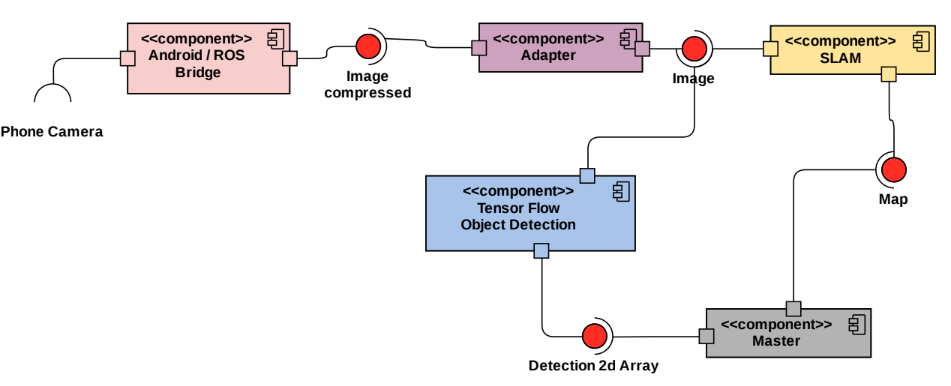

# Monocular SLAM coupled with tensorflow object detection

## Objective of the Project
The purpose of this project is to be able to map a new environment by giving information on the topology of the environment as well as the object of persons recognize in it. This mapping requires a gathering of images coming from a camera. Usually in SLAM, a stereo camera is used i.e. a camera with two or more lenses which allows the camera to simulate human binocular vision, and therefore gives it the ability to capture three-dimensional images (cf: wikipedia). The particularity of this project is the type of camera chosen. Indeed, it is not so common to have a stereo camera as it is more expensive and dedicated to more precise work. In the contrary, monocular camera are very common and most people posess one as it is embedded on smarthpone or even laptop. The purpose of this project is therefore to be able to map a new environment easily and without specific equipment.


To do so, the ORB_SLAM2 git repository will be use to execute the SLAM while the Tensorflow repository will allow the object detection. The image will le acquired from the camera of a smartphone through an Android ros bridge.


This configuration will allow a very portable solution. To test it, we will setup a scenario with interesting objects in a small room and evaluate the slamming as well as the object recognition. 

## The System’s Architecture

### Overall Architecture
<p align="center"> 

</p>
As seen above and as discussed in the objective of the project, the project will be divided around three majors module, ORB_SLAM2, Tensorflow and the Android camera image acquirement. 


It describes what the project wants to achieve and defines the key terminologies of this project. Presents the hardware or tools used in the project.

### Description of the Modules
* **[ORB_SLAM2](https://github.com/raulmur/ORB_SLAM2)**

This repository contains several ways of implementing SLAM among which Monocular, Stereo and RGB-D. In this project, the focus will be on the Monocular on as it correspond to the camera of a smartphone. Its functionning is close to a usual SLAM program : images are harvested and interpreted in real time. With information about the depth of the different part of this image, it is possible to place points on a 3D maps corresponding of the points of interest of the image and their distance to the camera frame. 


From the position differential of the points of interest, it is possible to deduct the movement of the camera compared to its last position. Once enough points are gathered, it is possible to have an overview of the environment (dimension, obstacle, structure,...) and even to close a "loop" if it is detected that the camera has came back to its position. 


The input of this module (*/camera/Image_raw*) is raw images that can com from either a real-time system, the phone camera for instance, or a sequence of images put together in a rosbag. 
The outputs of this module are the position of the camera (*ORB_SLAM/Camera*), the current image being processed (*ORB_SLAM/Frame*) and finally the global map (*ORB_SLAM/Map*) as an instance of the class Marker defined in the vizualisation_msg package.
In this project, only... will be used.

* **[ip_camera](https://github.com/ravich2-7183/ip_camera)**
This repository contains a ROS node to read frames from and ip camera stream and publish to a ROS topic (*/camera/Image_raw*). This repository need to be used with a streaming camera phone application. This repository has been tested with the [IP Webcam](https://play.google.com/store/apps/details?id=com.pas.webcam&hl=fr) application of the google play store.

* **Tensorflow**


It describes all the modules within the architecture, i.e, (i) the inputs, (ii) the internal working, and (iii) the outputs.

## Implementation

### Prerequisites
It describes all hardwares and softwares that are required for running the system.

### How to run the project
- For the ORB_SLAM2 repository:
	1. Install all the required prerequisites mentionned in the part 2 of the [repository](https://github.com/raulmur/ORB_SLAM2).
	2. Clone the repository as described in part 3 but do not build yet.
	3. Add the lines:
	```
	#include<unistd.h>;
	#include<stdio.h>;
	#include<stdlib.h>;
	```
	At the beginning of the files *Viewer.cc*, *Tracking.cc*, *LoopClosing.cc* in src and in Examples, every *file.cc* in Monocular, Stereo and RGB-D (for instance: *Examples/Monocular/mono_tum.cc*)
	
	4. Build as mentionned in part 3
	5. Modify the file *Examples/ROS/ORB8SLAM2/CMakeLists.txt* to have :
	```
	set(LIBS
	${OpenCV_LIBS}
	${EIGEN3_LIBS}
	${Pangolin_LIBRARIES}
	${PROJECT_SOURCE_DIR}/../../../Thirdparty/DBoW2/lib/libDBoW2.so
	${PROJECT_SOURCE_DIR}/../../../Thirdparty/g2o/lib/libg2o.so
	${PROJECT_SOURCE_DIR}/../../../lib/libORB_SLAM2.so
	-lboost_system
	)
	```
	Also, change ```find_pachage(Pangolin REQUIRED)``` by ```find_pachage(Pangolin 0.2 REQUIRED)```
	6. Build as explained in the part 7 of the git repository.
	
	7. Source
It describes step by step how to download and run the project on a new computer.

- For the ip_camera repository:
	1. Clone the repository in your catkin workspace
	    ```
		git clone https://github.com/ravich2-7183/ip_camera.git
	    ```
	2. Download a ip camera application on your phone
	3. Stream your camera using the same wifi connection for your phone and your computer where the ROS is running
	4. In the *ip_camera.launch* change the IP of the streamed video to your IP webcam which should look like that for example: 
 	    ```
		http://192.168.1.5:8080/video		
	    ```
	5. Launch to have the streamed camera publish inside a ROS topic

   	    ```
		roslaunch ip_camera ip_camera.launch
	    ```
Now it is possible to achieved monocular slam using a phone camera.

## Results
It presents the result using (images or videos) of the working system, in (real or simulation).

## Recommendations
The Recommendations follow naturally from the conclusions. They describe: the assumptions made while building the system (and/or) the limitations of the working system. Therefore, presenting possible ideas that could overcome the limitations or assumptions. 

## Authors
* FirstName LastName: email@email.com
* FirstName LastName: email@email.com
* FirstName LastName: email@email.com

# Useful GitHub readme syntax

## To make bullet points

* Do this
	* Do this

## To make hyper-link

For example, making a link to [ROS tutorials](http://wiki.ros.org/ROS/Tutorials)

## To show, how to execute some commands in the terminal

    ```
    sudo apt install ros-kinetic-opencv3 #(should be already installed with previous point)
    sudo apt install ros-kinetic-opencv-apps
    ```

## To exphasize about a particular command

For example: Please do a ```catkin_make ```, once you have modified your code. 

## To add image(s) or video(s)

* To embbed an image

<p align="center"> 

</p>

* To link a [video](https://youtu.be/-yOZEiHLuVU)

### Link to the repository that has this readme

[The link](https://github.com/EmaroLab/GitHub_Readme_Template)
