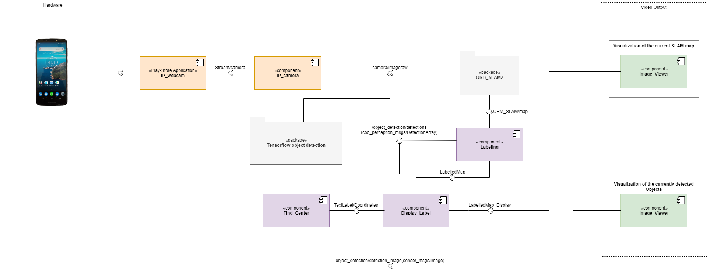

# Monocular SLAM coupled with tensorflow object detection

## Objective of the Project
The purpose of this project is to be able to map a new environment using monocular SLAM and an object recognition algorithm. This mapping requires a gathering of images coming from a camera. Usually in SLAM, a stereo camera is used i.e. a camera with two or more lenses which allows the camera to simulate human binocular vision, and therefore gives it the ability to capture three-dimensional images (cf: wikipedia). The particularity of this project is the type of camera chosen. Indeed, it is not so common to have a stereo camera as it is more expensive and dedicated to more precise work. In the contrary, monocular camera are very common and most people posess one as it is embedded on smarthpone or even laptop. The purpose of this project is therefore to be able to map a new environment easily and without specific equipment.


To do so, the ORB_SLAM2 git repository will be use to execute the SLAM while the Tensorflow repository will allow the object detection. The image will be acquired from the camera of a smartphone by streaming it through internet network.


This configuration will allow a very portable solution. To test it, we will setup a scenario with interesting objects in a small room and evaluate the slamming as well as the object recognition. 

## The System’s Architecture

## Architecture of the System
<p align="center"> 

</p>
As seen above and as discussed in the objective of the project, the project will be divided around three majors modules, ORB_SLAM2, Tensorflow and the phone camera image acquirement. 


The UML describes what the project wants to achieve and defines the key terminologies of this project. Presents the hardware or tools used in the project.

## Description of the System’s Architecture
### Module <**[ORB_SLAM2](https://github.com/raulmur/ORB_SLAM2)**>

This repository contains several ways of implementing SLAM among which Monocular, Stereo and RGB-D. In this project, the focus will be on the Monocular on as it correspond to the camera of a smartphone. Its functionning is close to a usual SLAM program : images are harvested and interpreted in real time. With information about the depth of the different part of this image, it is possible to place points on a 3D maps corresponding of the points of interest of the image and their distance to the camera frame. 


From the position differential of the points of interest, it is possible to deduct the movement of the camera compared to its last position. Once enough points are gathered, it is possible to have an overview of the environment (dimension, obstacle, structure,...) and even to close a "loop" if it is detected that the camera has came back to its position. 


The input of this module (*/camera/Image_raw*) is raw images that can com from either a real-time system, the phone camera for instance, or a sequence of images put together in a rosbag. 
The outputs of this module are the position of the camera (*ORB_SLAM/Camera*), the current image being processed (*ORB_SLAM/Frame*) and finally the global map (*ORB_SLAM/Map*) as an instance of the class Marker defined in the vizualisation_msg package.
In this project, only... will be used.

### Module <**[ip_camera](https://github.com/ravich2-7183/ip_camera)**>

This repository contains a ROS node to read frames from an ip camera stream and publish them to a ROS topic (*/camera/Image_raw*). To achive this the computer vision librairi openCV is used. This repository need to be used with a streaming camera phone application to stream your phone camera through wifi. It has been tested with the [IP Webcam](https://play.google.com/store/apps/details?id=com.pas.webcam&hl=fr) application of the google play store of android.

### Module <**[Tensorflow](https://github.com/cagbal/ros_people_object_detection_tensorflow)**>

This repository contains the mains nodes to compute label objects rocognition. It will read a camera stream, detect objects with their labels and their probabilities and then publish the result in an array.

For our project, we will only use object recognition. The input will be the ROS topic (subscribe) : ("/camera/image_raw") were our node (cob_people_object_detection_detection) will subscribe. 

As ROS bridge is working with python2 we will use tensorflow with python2

And the useful output topic (publish) will be:
- /object_detection/detections (cob_perception_msgs/DetectionArray) : that is an array that include all the detections with probabilities, labels and bounding boxes
- /object_detection/detections_image (sensor_msgs/Image) : that is a ROS image message with the bouding box, label, and probability 


It describes all the modules within the architecture, i.e, (i) the inputs, (ii) the internal working, and (iii) the outputs.

## Installation and System Testing

### Module <ORB_SLAM2>
1. Install all the required prerequisites mentionned in the part 2 of the [repository](https://github.com/raulmur/ORB_SLAM2).
2. Clone the repository as described in part 3 but do not build yet.
3. Add the lines:
```
#include<unistd.h>
#include<stdio.h>
#include<stdlib.h>
```
At the beginning of the files *Viewer.cc*, *Tracking.cc*, *System.cc* *LoopClosing.cc* *LocalMapping.cc* in src and in Examples, every *file.cc* in Monocular, Stereo and RGB-D (for instance: *Examples/Monocular/mono_tum.cc*)

4. Build as mentionned in part 3
5. Modify the file *Examples/ROS/ORB8SLAM2/CMakeLists.txt* to have :
```
set(LIBS
${OpenCV_LIBS}
${EIGEN3_LIBS}
${Pangolin_LIBRARIES}
${PROJECT_SOURCE_DIR}/../../../Thirdparty/DBoW2/lib/libDBoW2.so
${PROJECT_SOURCE_DIR}/../../../Thirdparty/g2o/lib/libg2o.so
${PROJECT_SOURCE_DIR}/../../../lib/libORB_SLAM2.so
-lboost_system
)
```
Also, change ```find_pachage(Pangolin REQUIRED)``` by ```find_pachage(Pangolin 0.2 REQUIRED)```

6. Build as explained in the part 7 of the git repository.

7. Source
It describes step by step how to download and run the project on a new computer.

8. To use it, you just have to write in your terminal:
```
	rosrun ORB_SLAM2 Mono *PATH_TO_GO_TO/*Vocabulary/ORBvoc.txt *PATH_TO_GO_TO/*Examples/ROS/ORB_SLAM2/Asus.yaml
```
For instance, if you are in your ORB_SLAM2 repository:
```
	rosrun ORB_SLAM2 Mono Vocabulary/ORBvoc.txt Examples/ROS/ORB_SLAM2/Asus.yaml
```

### Module <IP_Camera>
1. Clone the repository in your catkin workspace
```
git clone https://github.com/ravich2-7183/ip_camera.git
```
2. Download a ip camera application on your phone (for example [IP Webcam](https://play.google.com/store/apps/details?id=com.pas.webcam&hl=fr))
3. Stream your camera using the same wifi connection for your phone and your computer where the ROS is running(to limitate the latency in the camera stream you can reduce the quality of the video to *320x240p*)
4. In the *ip_camera.launch* change the IP of the streamed video to your IP webcam which should look like that for example: 
```
http://<your_IP>:8080/video		
```
The IP is clearly given on the [IP Webcam](https://play.google.com/store/apps/details?id=com.pas.webcam&hl=fr) application while your are streaming.

5. Launch to have the streamed camera publish inside a ROS topic (*/camera/Image_raw*)
```
roslaunch ip_camera ip_camera.launch
```
This launch will be needed to use tensorflow and the slam with your android phone camera.
If you don't openCV install on your computer the package will not work. Therefore, it is necessary to install it by executing:
```
sudo apt-get install python-opencv
```

### Module <ros_people_object_detection_tensorflow>
1. Install all the prerequisites :
- I will use tensorflow-gpu so you need to be sure you have all the drivers for you graphic card you can fin it in the section "Software requirements" on [this page](https://www.tensorflow.org/install/gpu)
- You need to install CUDA (if you have nvidia card): please follow this [tutorial](https://docs.nvidia.com/cuda/cuda-installation-guide-linux/index.html)
- you need to have python2 on your computer : 
```
$ sudo apt update
$ sudo apt install python-dev python-pip
$ sudo pip install -U virtualenv  # system-wide install
```
- you need image_view if you don't have it
```
$ sudo apt-get install ros-kinetic-image-view
```

2. Clone the repository in you catkin workspace
```
$ cd ~/catkin_ws/src 
$ git clone --recursive https://github.com/cagbal/ros_people_object_detection_tensorflow.git
$ git clone https://github.com/cagbal/cob_perception_common.git
$ cd ros_people_object_detection_tensorflow/src
$ protoc object_detection/protos/*.proto --python_out=.
$ cd ~/catkin_ws
$ rosdep install --from-path src/ -y -i
$ catkin_make
$ pip install face_recognition
```
3. Create your virtual environnement and install [tensorflow](https://www.tensorflow.org/install/pip?lang=python2)
```
$ virtualenv --system-site-packages -p python2.7 ./venv
$ source ./venv/bin/activate
$ (venv) pip install --upgrade pip
$ (venv) pip install --upgrade tensorflow
```
try to see if it is working
```
$ (venv) python -c "import tensorflow as tf;print(tf.reduce_sum(tf.random.normal([1000, 1000])))"
```
If the output of this is some errors, that's mean you probably don't have all the required libraries with your graphic card in order to run tensorflow (most of the time realated to CUDA), please see the error comments below.

4. Change the topic input : go on ~catkin_ws/src/ros_people_object_detection_tensorflow/launch and edit cob_people_object_detection_tensorflow_params.yaml : you need to comment the line 14 (depth_namespace ...) and to change the topic ligne 11 : camera_namespace: "your_topic". For instance if you want to use the camera from ip_camera : camera_namesapce : "camera/image_raw".

5. The repository used depreciated function of tensorflow, so you need to change all this files by the ones in this repository (/!\ TO DO /!\)

6. Run everything 
```
$ roscore
$ roslaunch ip_camera ip_camera.launch #if you are using ip_camera
$ source ~/venv/bin/activate
$ (venv) roslaunch cob_people_object_detection_tensorflow cob_people_object_detection_tensorflow.launch
```
if you want to see the result :
```
rosrun image_view image_view image:=/object_detection/detections_image
```

- Most common error : 
- somme error with libnvinfer.so.6 or other librairies : I advise you to use synaptic to install the missing librairies because it know all the needed dependencies:
```$ sudo apt-get install synaptic ``` 
and then 
```$ sudo synaptic```
Then you can search the librairy by name and install it.


### Result
Here the result of the three modules working together:


It can observe the monocular SLAM working with the point and the maps buillding and at the same time tensroflow is achieving object recognition.
The object recognition is working good. The monocular loose track of its position some time but easily find it back when we go back to position that have already been map.

## Report
This is the link to the report: < put the link here >

## Authors
* Kenza Bourbakri: kenzaboubakri@gmail.com
* Thomas Gallo: thomas.gallo00@gmail.com
* Théo Dépalle: theodepalle@gmail.com
* Paul Ndjomo: n.ndjomo93@gmail.com
* Vivek Vijaykumar ingle: vivekvijay380@gmail.com
* Lennart Döhle: lennart.doehle@gmx.de

<!--
# Useful GitHub readme syntax

## To make bullet points

* Do this
	* Do this

## To make hyper-link

For example, making a link to [ROS tutorials](http://wiki.ros.org/ROS/Tutorials)

## To show, how to execute some commands in the terminal

    ```
    sudo apt install ros-kinetic-opencv3 #(should be already installed with previous point)
    sudo apt install ros-kinetic-opencv-apps
    ```

## To exphasize about a particular command

For example: Please do a ```catkin_make ```, once you have modified your code. 

## To add image(s) or video(s)

* To embbed an image

<p align="center"> 

</p>

* To link a [video](https://youtu.be/-yOZEiHLuVU)

### Link to the repository that has this readme

[The link](https://github.com/EmaroLab/GitHub_Readme_Template)
-->
